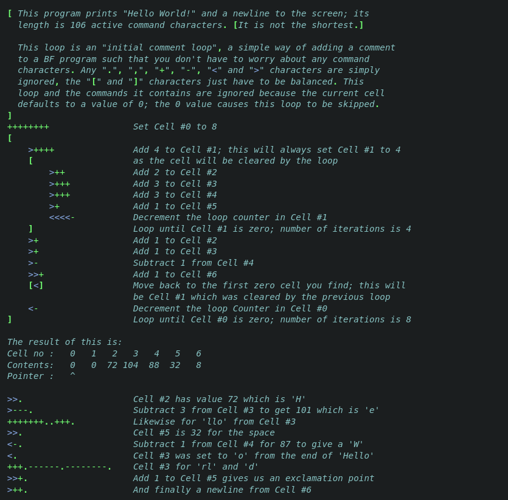

# G Language Overview

## Purpose
This language was originally inspired by an esoteric language called 'brainfuck'.
Brainfuck is interesting for a number of reasons, but one thing that caught my eye
way this example from wikipedia

What I found interesting was that general text could be written without needing to
specify that it was a comment. There were some restrictions, including the special 
operators that brainfuck uses, but generally a person could simply write whatever
they wanted, wherever they whanted, and it would be fine.

This was only a valid code design, however, because the operator set was so small
that you didn't really need any of them to write what you wanted to say. This led
me to the question that ultimately started this journey
> Can you make a useful programming language that can differentiate comments from code without special identifiers?

The answer to that question, surprisingly, is yes.

## Basic Structure

G as a language is broken into two primitive elements, **code** and **prose**.
Prose is any general, plain text that is not intended to be executed. The goal for
this language was that prose could be written anywhere in the code, without needing
any kind of indicator. Code, on the other hand, is actual executable instructions.
I will go into great detail about the lexical and grammatical structure of G much
later, for those interested, but for now I want to show off some G.

#### ROT13 in G
---
```c
plain text prose can go pretty freely in the code
char: rot13(char: c) {
    there is very little restriction on where you can 
    write prose

    if(c >= 'a' && c <= 'z')
      return('a' + (c - 'a' + 13) % 26);
    
    prose cannot be within a single statement
    unless that statement is scoped
    
    if(c >= 'A' && c <= 'Z'){
      this prose is valid, since the expression is
      scoped with the braces
      return('A' + (c - 'A' + 13) % 26);
    }
    return(c);
}

int: main(){
    comments can go before int: c; or after
    a statement,, so that declaration will
    be executed

    while((c = getchar()) != EOF)
        putchar(rot13(c));
    
    return(0);
}
```
For clarity, the 'c' identifier is used when code blocking this. It is labled as C
since there is not currently support for this language in the Github markdown processor.

The reason this works comes down to how code is actually defined in G. Code is really
relagated to a few primitive constructs, those being
- declarations
- statements
- expressions
- definitions

Any text that does not fall into the signature of these categories is classed as prose.
This means that prose does have some restrictions, though they are pretty generous. The
restrictions on prose are that it cannot
- contain an operator
- contain grouping symbols
- split a primitive construct before it finishes

This may seem fairly restrictive, but once you get used to the setup it feels quite natural.
There are no reserved 'words' in G, so you can use `int`, `return`, `if`, etc freely in prose.

One thing to note , is that some chars are explicitly unreserved to allow things
like a limited set markdown to be written in the program. That essentially means that if you
change the extension on a .g file to .md, you could read it like a markdown document. Specifically
hashtag and triple dash were left alone.

Another important idea is the **prose escape**. A prose escape is identified with backtick, ( \` ), 
and is used when you want to show an explicite G operator in your prose. The interesting part is that
markdown will consume this as a code block, so it is naturally compatible, as you would really only
use it when you want to identify code.

So the first question would get about this is "what if I want to comment out my code?" and that
is very simple, since G just has regular comment expressions as well
```c
  // double slash indicates single line comments
  /*
      block comments can be done with slash star,
      this is all pretty standard. Due to how G is
      structured, you could just use a prose escape.

      The reason you would not do this is because
      a comment is explicitely meant to be code that
      is not currently being used, whereas prose is
      actual documentation.
  */
```
That pretty much covers the unique part of the challenge for G, but I ended up doing a lot more
with this language than I originally expected. Here are some other examples.
```c
Inline function definitions
int: add(int: x; int: y) return(x + y);  

Scoped fucntion defintions
void: foo(){
  int: add(int: x; int: y){
    return(x + y); 
  }
  so you can make a call from within
  print(add(6, 7));
}

Declaration chaining
int:add(int: x; int: y), 
    sub(int: x; int: y),
    mul(int: x; int: y);

private:{
  int:{
    these guys all have the type `private, int:`
    add(int: x; int: y);
    sub(int: x; int: y);
    mul(int: x; int: y);
  }
  where as this is `private, float`
  float: x, y, z;
}

Conditionals and loops can be expressions
int: x = if(c) 5 else 4; is perfectly valid

Basic Object Oriented Programming

struct: mystruct{ 
  private:{
    int: x, y, z; 
  }

  int: getX() return(self->x);
} 
```
G also has something that is a unique to it, which I came up with and later
found out that Python already did (it's not the same, but it looks the same).
The unique control flow object is called a **while-else** statement or expression.
The else is essentially a case for when the loop never enters, so you have a
fallback condition baked in.
```c
 int: i = 0, 
      value = while(i<x; int: result = 0){
      if(i == limit) break();

      if(i%2 == 0)  result += i;
      else result -= i;

      i+=1;

      if(x > 100) return(x);
  } else {
      x;
  };
```
So the declared variable in the argument is where the result of the expression will
be stored, so `value` will be set to whatever result is at the end of the loop. Should
the loop never enter, however, it will be set to the else conditions final expression.

G is still new and has a lot of changes yet to be made. I plan to implement verlig-like
bitwise reductions and expand heavily on the C unary operations. This has been a super
fun project and I have enjoyed it a lot. I have a public github repo with G source 
if anyone wants to mess with the ANTLR code for the parser.

[https://github.com/gpavlun/glang/tree/main](https://github.com/gpavlun/glang/tree/main)