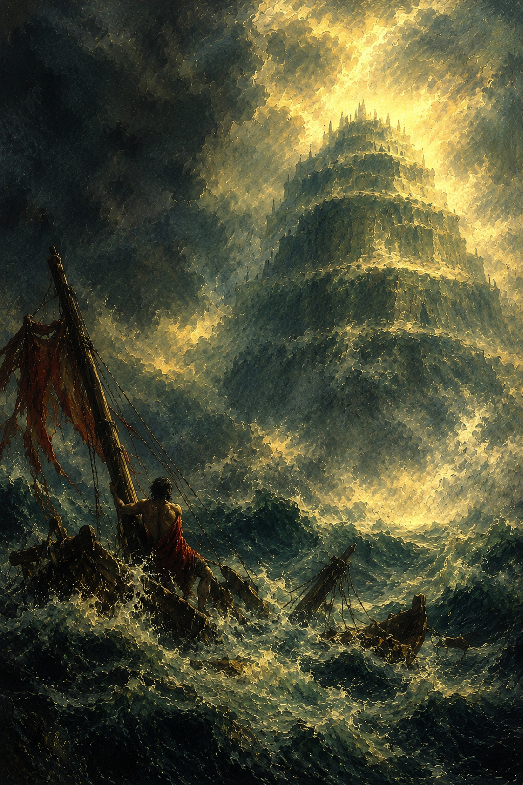

What is the inspiration when the situation calls for desperation? Whilst this I cannot answer,
I can instead speak on the nature of the animal. The animal, in this sense, being a horse.

A horse who does not have a name.  
Why does the horse not have a name?  

The answer is simple, when you think about it. The name of the horse is, in fact, simply **horse**.
This is because to name a horse, you lose the horse in the name. The name is a descriptor, but the
name becomes lost and muddied when you try to evolve it. Instead, simply sit and let it speak for
itself.

I would say this is self-evident, but I know it is not to many, so I will elaborate.
### Names
Names have power. This is said over, and over, and over, and, occasionally, under. The problem is that
fools and wise men alike oft-madeen conflate the name itself with the meaning, when the meaning is what
gives the name its power. An idea has power, not a name, but it is in associating the name with the
idea that the name gains power through abstract transitivity.

Take, for instance, a horse. A horse has a great deal of imagery associated with it. The horse has strength,
beauty, elegance (as well as awful gas, general brain-dead decision making, and a fear of anything that moves).
I, personally, love horses. They are one of my great passions in life, which is why it annoys me when the
name is conflated incorrectly with the idea.

One can be called a **horse**, or perhaps a **stallion**, or even a **stud** to show their power and ability.
The analogy is excellent; it inspires an aurous image in the minds of the beholders. This would lead one
to believe that the word **horse** has some inherent power to it. The old Norse use **hestr** to refer
to the beasts, with the runes reading **ᚼᛁᛋᛏᛦ**. Such a word inspired the theology of ancients across the
world, horse-gods, horse-icons, mythical horses, unicorns, the sheer utterance of the name carrying weight.
This, of course, is the folly of men. The word means nothing, it never has. The word is a lexical artifact used
to express an idea, which unfortunately must be transferred via the medium of sound wave distortion, since the
pitiful human mind is incapable of inferring abstraction via disembodied consciousness. This is proven in the
divine expression of men in the physical world, that is to say in art.

### Art
Oratory is an art in and of itself, sure, but to scope ourselves to such a poor medium would be a disservice
to the lecture. Instead, see how the art of the world moves thought. A painting, or better yet, a drawing, can
inspire much more than a word can. It can convey a feeling far outside the realm of what a passive observance
of the universe could. Insert obligatory Dante reference.

"So it is not words that have power, but art!" I hear you cry. Nay, curr. Have you not listened to a word
I have said? Is the purpose of this text lost on you? It is enough to drive a man to the brink of insanity.
That is to say, assuming that the insanity occurs on the +0 side of the impulse, that we are approaching
sanity when reaching this brink, as we are already well into the depths of incomprehensibility.

No no no no no no no—nono onoa nono— the art has no power just as the word has no power just as the music has
no power. It is the idea of the beast itself that carries that power. What is **horse** is there is no
physical creature with which to draw the name from. Now you should know.

Take it further?

The oft-made claim of **Óðinn**, where his name is the power and the runes he holds are the power by nature of
their descriptors. Die Stäbe. The symbol is not the power, just as the word is not the symbol. When you mumble
to yourself the absurdities of the **Ehwaz** or **Ansuz** and assume that the symbol itself, or worse, the spooky
word is the holder of power, you fail to see the power that is actually contained within.

### The Eclipse of Time
Imagine, for a moment, the slow crawl of time, and with it the cycles of ages. How is it that one can convey
the very thought in their mind to generations that come after them? How could one possibly handle the impossible
task of preserving themselves long after their death in a way that does not keep their body, but instead keeps
their mind? The answer to this question comes in the form of abstract human art. And there it is, the true combatant
of time, the enemy of the slow march of death, Thorr against Elli. The truth is that the name **is** powerful. The
name is powerful not because it means anything itself, but instead because it can convey meaning across eons.

So why the vulgar assault on the minds of the readers, if they were right all along? Because being right, but not
knowing **why** you are right is just as criminal as being wrong. Perhaps moreso. The problem with the logic
is that a man may invoke a name to convey power, but in doing so he lessens the weight that the name holds.
When a fool insists on using an ancient name, they fail to understand that the name itself does not have more
power simply by virtue of being old. The idea may go by whatever name you care to give it, no matter language,
style, or universality. So why call him **Óðinn**? Is **Odin** not just as effective? Doth not his name carry
the meaning, regardless of the "correctness" of the word. Perhaps I should insist that using latin alphabets
is anachronistic, instead we should say **ᚢᚦᛁᚾ**, but wait, that was Viking Age anachronism on the earlier name,
so really **ᛟᚦᛁᚾᚾ** is correct. But ALAS, the name is a modern interpretation, for the truly ancient do not
use his name so brazenly, which means **ᚺᚨᛏᛁᚹᚨᚺᚨ** would be more appropriate. The absurdity is self-evident.

### Without Name
The truth of the matter, however, is that not having a name is more powerful than having one. If the horse
has a name, let's call him Major, then the name is now conveying a different idea onto the beast. So now you,
you see, he is not a horse anymore. He is an individual, and a major no less! This says to us that this horse
is a stout and competent beast, rather than simply an idea.

This seems exquisite, no? The meaning the beast carries is evolved and grows to show a new angle through itself.
You are mistaken.

The name, once given, creates an individual. It narrows the idea to a smaller scope. It ties the spirit of the
beast to a single conception, which in turn loses the power its idea once held. You are not thinking about the
idea of a horse, you are thinking about this horse in particular. This is no slight to Major, I miss him dearly,
but now his spirit will be buried with his name. When I forget his name, as I one day will, will anyone be there
to remember him? To carry him through the ages?

Think now instead of the Winged Hussars, the name itself is enough to inspire a man. The thunder of hooves, the
beat of iron wings, as the cavalry lays low the fiercest of armies. Though I would ask you, what is the name of
even one, single Hussar? It is unlikely that you could provide an answer. If you could, can you name two? five? ten?
Perhaps now you see the point of the writing. My claim is that a name could be a powerful tool, but it could also
be a restrictive one. I know my name will not be remembered, but what if instead I was an idea? What if instead
I tied myself to a concept so fiercely that myself and the idea were inseparable. What if the idea itself began
to reflect me back as I became one with it. To mantle the idea and become it. What if an idea was so ubiquitous
with me that I would be carried through history as that ideal. Insert obligatory Homer reference.

### With a Name
Examples of this are hard, let's see if we can find one. Let's start simple, **Einstein**. To be him is to be smart.
The name carries weight all of its own. One that is different from the name of **human**, but is it better? I am,
after all of it, only human. Only human? No, I am a human first and foremost. I am a descendant of millions of years
of men who came before me. I carry an indomitable spirit that cannot be conquered and cannot be erased. No, I would
say Einstein's name is not quite enough to contest this, so in time he too will be forgotten. Let's see further, ah!

I can think of one.

His name carries a strong image. His name lends an idea beyond merely a man, perhaps instead it resembles a god.
I would say this is so. His name is wrapped in gold, wielding a lance on a chariot from hell. It is both terror
and reverence. The name brings to mind an idea, separated from individual or duty. The name is

>ACHILLES.

This name is one of a man who does not care for the needs of others. A man who does not care for kings or gods. A
man so sure of himself, that even when faced with an endless sea of soldiers, when presented with titanous walls
and a hopeless pursuit, he forced the unbreakable to break. He pried open the jaws of the lion and wrenched its
tongue from its mouth. When he felt the most powerful men in the world considered him lesser, he chose to abandon
them and this was such a loss to them, that they had to apologize to his face. Even then, he told them he cared not
for their pleas. It was only when he felt compelled to act, that Troy fell before him.

This name carries weight beyond what you would expect. To me, it represents an idea. Achilles is an abstract representative
of the warrior spirit. He inspires man to do what cannot be done, to be what they could not be. That is the power
of his name. I would say there is a reason such a name is few and far between. Indeed this speaks volumes to me

  <iframe
    width="529"
    height="940"
    src="https://www.youtube.com/embed/fpvbJ9p6v6g"
    title="MIKE TYSON WANTS TO FIGHT ACHILLES!"
    frameborder="0"
    style="max-width: 100%; aspect-ratio: 529 / 940; height: auto;"
    allow="accelerometer; autoplay; clipboard-write; encrypted-media; gyroscope; picture-in-picture; web-share"
    referrerpolicy="strict-origin-when-cross-origin"
    allowfullscreen>
  </iframe>

Disregarding the typical youtube bullshit, to see that name come up when discussing the greatest fighter of all time
speaks more to me than anything else could.

That does beg the question, however. A good one too. Is the name of Achilles greater than the name of humanity? No.
I would not say so. So why bring up this at all? To show that no man is greater than man, in a sense. Just as no horse
is greater than horse. You can try, you can push yourself as far as you can and maybe you will get very close, but you
will not reach it. I do not think that you can.

But, perhaps, the greatest virtue a man can possess is in his striving to reach this goal. Who can say for sure.

