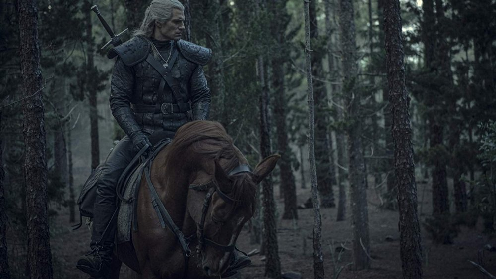
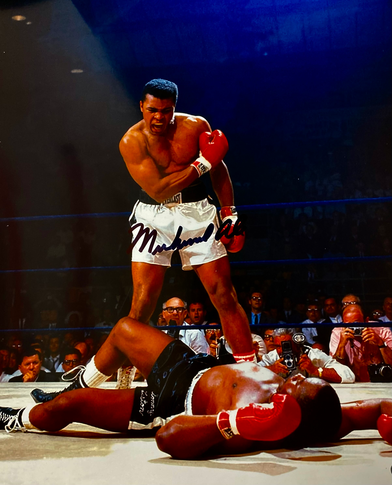

## Purpose
I felt compelled to write about this after hearing a dialogue between two followers of North-Germanic Polytheism
discussing the power of names. In particular, one held to the Norse pagan conception, whilst the other held to
the Anglo-Saxon conception. The focal point of their debate was around the name of the Runes, which take different
names in the two languages of origin that each faith draws from. This is true even within the individual doctrine,
as the names of the runes have changed and grown over time. This is apparent when you look into Proto-Norse names
versus Od-Norse names.

The reason for the conflict was that the names of the runes were said to hold power, so calling a rune by the wrong
name would be lessening its power. I would agree with this, should the former statement hold true. The part that
interested me was how the response of the Anglo-Saxon shunted my expectations. He said, simply, that the power of
the rune's name was in what it conveyed, not in the lexicon itself. That is a belief I have held for some time and
I felt it important enough to put the conception to writing.

My fundamental thesis, then, is as follows:
>The most meaningful ability a person can possess is the ability to convey their soul beyond their body. To
make themselves understood to another. To not only experience the world, but to have the experience be deeply
and truly understood by another.

## A Horse with a Name
So let us start with a poorly disguised refernce to a song that I like. There was once a horse that I worked with;
his name was Major. Major was a stout and humble horse, who did not care much for this or that. He, truthfully,
cared only for two things. The first was his food. The second, and arguably more interesting, was walking the trails.
See, Major did not care to ride in the arena, nor did he much care for the pasture. No, Major lived for the country-side.
He loved to meander through the woods and eat the leaves off the trees. He liked to walk through the fields and catch
bites off of the grass growing up taller than he was. So, maybe, his two desires are more closely related than I might
have initially thought.

Regardless, the reason for discussing this is that in my description of Major, you have gained an image in your head of
what he is. Now, you no longer see the horse as a horse, but instead as Major, a specific horse, with a specific
personality and desires. This carries a great deal of power, for now I can, in a single word, convey an idea that you
previously would not have held about the individual. This idea, however, is both a blessening and a curse. You see, now
that Major has separated himself, has identified himself as something unique, the abstraction that his name once presented
has become constricted. Let me elaborate.

The word **horse** carries a particular connotation beyond that of the name of an individual. When we stop calling Major a horse
and begin to call him Major, he loses the permanance that comes from his class. One day, Majors will die. When he does, his
name will only be remembered by me and a select few others. Then, when they die, and when I die, his name will be lost. He
will be lost. The essence that made him himself will become dust and be sent unto the endless waters of time. Washed away, and forgotten.
This is true of all things with names, so why does **horse** differ?

## A Horse with no Name
Take for a moment, a horse with no name at all. What is that? It is not an individual, but an idea. The idea is one such that it
conveys something far beyond what you might initially suggest. When you call someone a *stallion*, a *stud*, a *horse*, you are
imposing a particular category of thought onto the individual. You are not saying that they are themself, the fragile, temporary,
and ultimately fleeting concept of their physical form, but instead you are assigning them to an idea that speaks volumes beyond
them. You are saying that they are powerful, strong, virile. That is a much more powerful idea for a person to convey, than simply
their own time-bound existence. Though this presents a simple problem.

I miss Major.

I miss him dearly. I know vaguely of what became of him, but really I cannot say I know whether he is alive or dead. The problem is,
I do not miss horses; I miss that horse in particular. He was a good boy and if I was in the bussiness of making friends with beasts,
I would say that horse was my best friend. This name that Major carries—it means far more to me that the simple idea of a horse. A
horse does not mean much to me at all, in truth. So what is the point of these timeless and undying handles if they mean little to the
ones left behind? As I see it, the best version of the story would be one in which the name of the individual preserves them unto the
ages, without losing the thing that made them who they are.

## A Horse named Roach
For those of you familiar with the Witcher series, you may be aware of the protagonists horse, Roach. The thing that stands out about
Roach is that he is not a single horse. No, instead every horse that the witcher owns over the course of his life gets the same name.
This seemed odd to me at first, as I felt it was cruel to the horse. This is because the self would be lost among a dozen beasts with the same
name. I was wrong.

By the horse taking the name of Roach, it instead became a part of a grander story. The name survived far beyond the life of the single
horse, but preserved a part of what that horse was with it. When the witcher mentions his horse Roach, he is not talking about the
individual horse, but instead he is talking about all of the horses who brought him to where he is today. In a sense, he remembers them
whenever he thinks about his beast. They are a part of his story as much as their own and when their story ends, they survive with his.

> Geralt named his every mount Roach, though no one really knows why or what Geralt had in mind with this name. When asked, Geralt would dodge the question or give an evasive answer. Perhaps this had just been the first word that came to his head? Roach, for her part, seemed to accept the name with no reservations.

## A Horse named Horse
A silly thing, sure, a horse named "horse", but I would ask you to bear with me. This story was not originally about horses, but instead
about a man who had a dog named "dog". When I asked why his dog was named "dog," he told me that he thinks a dog is a dog and there is no
reason he ought to call it something else. He indeed names every dog he ever had "dog", which you may argue means that he was not naming the 
dog "dog", but rather leaving it nameless and addressing it by its handle. I would disagree.

It was true that he would say things to the effect of "stop that, dog!" and "sit, dog!", but he also genuinely approached the dog as if its
name was actually dog. His collar, for instance said "dog" on it and when taken to the vet, he would be signed in as "dog". So indeed his
actual name was, in all lowercase, "dog". I thought this to be more of a gag than anything else, but the more I think about it, the more
admirable I find the naming convention. That man does not think about a dog in the form of an archetype or a species, but instead "dog" is
his best friend in the world. He is the reliable hound that was always there when needed and was worth more on the ground than three men
in the saddle. So in a sense, this was not *a dog*, but infact this was *the dog*. There was no other to him.

In a sense, the dog had not taken the name dog, but rather that the idea of a dog came to be a representative of this dog (to this man, anyway).
That means far more than it might initially suggest. To this man, a dog was not a thing that could be applied here or there. No, it was
this very beast at his side. That means far more to me than any other name possibly could. When you think of a dog, this broad and idea, you now
have to carry in your head that small notion of that one dog named "dog".

## Reconciliation of the Thesis
So up to this point we have spent a while talking about names, but what does this have to do with sharing of human experience? My analogy of
a horse is fun, but let's drop it. When you speak to someone, you are trying to convey what is inside your mind to another. Some information will 
inevitably be lost in this process. You cannot accurately transmit your conscious experience to another by modulating
soundwaves from your vocal tract. Instead, you have to rely on universal ideas and experiences to wrap your intention in a way you can convey.
When you tell someone you love them, you have to admit that it is impossible for you to put the entirety of the emotional weight that the individual
you are addressing has on you into a single string of speech. Instead, you rely on the idea of love, the abstract concept, to carry the meaning
for you. You simply hope that the individual understands the idea of love the same as you. That is powerful.

And so this is were the power of a name comes from. The power is not in the word itself, but instead in the idea it conveys. When I speak the
name of Major, his name carries an image that represents him, but it is fundamentally a weaker image than the broader and more abstract concepts
we rely on in the day to day to express ourselves. The name of Major may be remembered by you, but it will not carry the same understanding that
it does for me. The emotional weight I feel from hearing that name will not be understood by another who simply hears the word. Love, however,
very well might be. So when I say I loved that horse, it conveys how I feel, but it does not capture what I feel that way about. This is the
greatest tragedy of life. Maybe someone who has loved a horse may understand that feeling, but they would not understand how I felt about that
damn animal in particular. I grow melancholic just thinking about it.

That being said, the idea of a name becoming something greater than itself is the solution to this issue. What if everyone in the world could
come to know the name of Major and how he lived and what he cared for most in life? Then his idea would be carried through the generations and
spirit would persist. What power that would be.

## A Name named Horse
Imagine for a moment if an individual became so ubiquitous with an idea that they could not easily be separated. Imagine an idea within your
mind, let's say a sport. When you think of that sport, is there a single individual that comes to mind? If so, you understand what I am saying.
Who is the "GOAT" of your sport? When I think of boxing, I think of Muhammad Ali, or perhaps Mike Tyson. These men who were so influential to
their sport that their names are hard to separate from the idea itself. When I think of boxing, I imagine this image in particular every single
time, without fail.

In a way, his name is tied to the sport more than any other. But the unfortuante truth of the matter is that his name is slowly becoming lost
as time marches. Now, if asked, most will speak of Mike Tyson as the greatest of all time. Deserved? Possibly. It does not change the fact that
his rise was, in a sense, the decline of the cultural memory of Ali. Such is the nature of time, though. It could be said that the true glory
seekers, the ones who hunt something beyond themselves are really hoping that their actions will associate them with the ideas in such a way
that they will be remembered, even if only for a time, after their deaths.

You could argue that the attempt is in vain, true. This seems a fair critique, as the truth of the matter is that their names are eventually
forgotten too. But what happens when this idea is taken to its logical extreme? Is there an individual whose name is so much a part of the idea
they represent that it cannot be separated from them?

Perhaps Elvis, right? Drugs, sex, and rock and roll. You think of him, you think of a generation. You think of the generation, you think of him.
Though, rock and roll has changed and no longer looks anything like what he started. The generation that grew up with him is aging and their
ideas are not carried by the youth in the same way. It would seem that he too will fade.

How about something more extreme? Hitler. The name everyone wants to forget but just can't seem to shake. In the modern day, if you want to call
someone evil, you could say they were worse than Hitler. In any media containing an image of hell, there is always a side joke about Hitler's
punishment in there somewhere. In truth, Hitler has become associated with the idea of evil in the same way as Elvis was with his generation.
His memory is thus preserved alongside the idea of evil, more than he deserves, in my mind.

So, upon hearing this, you may think that the solution is to become so similar to an idea that the idea and you are one in the same. That way
you can remembered simply by association with it. The issue with this line of thinking is that your individuality is lost in the idea. You have
to erase yourself in order to become the thing that people remember. You have to sacrifice something to communicate yourself through the idea.
This is a poor trade, in my mind. People remember that poster of Ali, but they try to forget the man who grew old, suffered from brain damage,
and degenerated into a shadow of his former glory. Muhammed Ali is not remembered, it is his association with the sport that is remembered. The
sport cannot convey the human being that participated in it. It simply cannot communicate this properly.

Instead, what if we were able to make the idea become a reflection of ourselves, instead of the other way around. What if everything that you
were came to represent an idea, so that when someone imagined this abstract concept, they would be remembering you specifically. That would indeed
be a powerful idea.

Ulysses

Every argument I have seems to devolve into a discussion about Odysseus. In a way, I think that reinforces the very idea we are discussing. That being said, realistically, if you want an escape hatch from Homer and Dante, you can jump down to the conclusion section of this essay. Otherwise, you can continue reading as I discuss the Odyssey and Dante's Inferno. Both are excellent reads, but for people who have already read one or both of them, it may be a bit boring to listen to me recount my interpretations of their plot elements and themes.

The Odyssey is a story about one man's attempt to overcome a world that seems determined to kill him at every opportunity. From a philosophical perspective, Odysseus represents the human struggle against a grand and cosmic world that cares little for humanity. He is constantly thrown from island to island, shipwrecked, and assaulted by monsters and gods from all sides. Odysseus must essentially be at the peak of human physical and mental performance to survive this, but even then, it is said that without extreme luck and the help of a god, he would not have survived.

While the body and mind of Odysseus are impressive feats in their own right, where Odysseus really shines is in his ability to influence other men. He is able to inspire people to his cause like no other. He can wile and connive his way into the halls of kings, and from them he can gain the wealth of their entire nations with nothing but his words. On his own, Odysseus means nothing. No amount of muscle or intelligence can save a man from raging ocean storms or from being completely stranded on an island. Odysseus is really able to accomplish as much as he does because he is able to inspire people to his side.

When Odysseus meets the Phaeacians, a group of people living in what is essentially a utopia, he is able to convince them to help him, even though it is known to them that helping him would doom their civilization. The people here have ships that navigate themselves, endless food and drink, and more wealth than any nation in the mythological world. Why would they help this random guy they have never met before and risk everything they have worked for? The king of Phaeacia helps Odysseus because he believes that Odysseus' story will last beyond his own life. He believes that simply being a part of Odysseus' story is more impactful than any other thing he could possibly do.

The basic idea is that Odysseus is attempting to mantle what it means to be human. He wants the idea of a human to become synonymous with himself. That is the reason that the Phaeacians help him. They feel that he represents something beyond any one individual and that if he were to succeed, they would be immortalized as part of him. For Odysseus to succeed is for humankind to succeed.

The story of Odysseus ends rather anticlimactically, in a way. Sure, the slaughter in the hall was impressive, but the ending is essentially a deus ex machina, where Odysseus is commanded to put down his oars, symbolizing his abandonment of his real motivation. I should note, if it is not clear, that reaching his home in Ithaca was never Odysseus' real motivation. The guy spent years on an island having sex with a goddess before he got bored and decided to sail home. This story, however, can continue if we look to another text.

Moving from Homer to Dante, we see that, in the Inferno, Odysseus is burning in hell for his arrogance. But more importantly for us, Dante continues the story of Odysseus with these lines:

>“When I finally got away from the enchantments of Circe, who had kept me and my crew captive for more than a year near Gaeta (before Aeneas had called it that), no bonds with my son, no honor for my aged father, no happy debt of love I owed my wife, Penelope – nothing could quench the burning desire deep within me to know the world as much as possible and to experience all human vices and all human worth![12]
>
>“So, with only one ship left, and that small crew of men who hadn’t deserted me, I set out upon the deep. Already behind us were Sardinia and the other isles in that sea. Then I saw the shores of Spain and Morocco. Me and my mates were old men, and tired. Finally, we reached the narrows at the Pillars of Hercules, which warn men not to sail beyond that point. By now we had passed Seville on the right, and Ceüta on the left.[13] ‘Brothers!’ I said to them, ‘You have survived a hundred thousand dangers to reach the West during this oh so brief vigil of our senses that is still left for us! You cannot deny yourself the experience of what lies beyond, behind the setting sun, the world unknown. Think of where you’ve come from: you are Greeks, not savages! You were not born to live like brutes, but to follow the ways of excellence and knowledge.’[14]
>
>“With this short speech, I made my old companions so excited about what lay ahead that nothing now could have held them back.[15] So, with the dawn behind us, our oars became like wings for that mad flight, rushing headlong, and always to the left. By now, our usual night stars no longer rose above the ocean – we had exchanged them for those of the other pole.[16] It was five months after we had sailed past the great Pillars when, far in the distance, a mountain appeared darkly. It rose endlessly into the sky! I had never seen another like it.[17]
>
>Overjoyed at first, our elation soon turned to grief. Out of that new world came such a wind that three times our ship was thrown around in the maelstrom. A fourth wind blasted at the stern, raising it up and sinking the bow – all as willed by Another. With that, the waters closed high above us.”[18]

What this suggests is that Odysseus could not give up his oars. He could not abandon his quest to become one with the nature of humanity. He sailed so far that he reached the very edge of the world. He found the limits of humanity. Odysseus came to know everything that there was to humanity, but he wasn't satisfied. He wanted to become more than just a human. He wanted to replace what humanity was with himself, to allow himself to become the new image of the world.

So he rowed further, behind the sun itself. He had now surpassed the guiding light of the world and continued, desperate to become a new idea. Symbolically, Odysseus passing the Pillars of Hercules shows that he is traveling beyond what humanity can accomplish, and in that way, he is replacing the defined limit of humanity with his personal limit.

This voyage, however, ends when he is literally smitten by God for his arrogance and cast into hell. That, I would say, is a much more fitting end for Odysseus: dying in an attempt to achieve something no other could. He reaches that mountain in the void, he finds what he was looking for: an origin point for the very nature of reality. But it is simply not for mortal men to obtain this power.

## Conclusion
The unfortunate truth is that Odysseus cannot actually achieve this. Nor can anyone else, as far as I can see. For someone to truly transcend the idea of humanity and become the very concept of it, I think they would lose the motivation that made them pursue that goal in the first place. It is the human experience that we are trying to convey to another, so becoming the definition of a human would lose the inter-human communication that was desired to begin with. The entire point of this exercise was to find a way for one person, one human being, to share their experience of the world with another. Odysseus, in his mad pursuit of conceptual immortality, loses the need for that communication. So, by becoming the definition of humanity, he would indeed persist, but the humanity he wanted to communicate with would no longer exist outside of himself.

It would be an awfully lonely world, for a god. I would image that if one were to make a world from themself, they could never truly experience what it would
be like to be a part of that world, as they are the conceptual entirety of it. Think of it like an author. The author can never experience the story they have
written as someone reading it for the first time would. The author would know every decision, every motivation, every influence of every part of the story. In
this way, there is nothing a character in that story could try to say to the author that the author did not already know. All of this to say, that in truth,
the human struggle to be understood is part of what makes someone human. By trying to find a "solution" to this, one would be required one to abandon the source that motivated them in the first place.

In truth, my ultimate desire would be for someone to be able to wholly and completely understand me, but I believe that if I were to succeed in this, I would
lose the thing I hoped to convey. That is not to say I think the effort is a poor one, quite the opposite. I believe that the desire to be understood by others
is part of what makes us human. One's ability to impress upon their surroundings what they feel is one of the great expressions of the human condition. It is
the source of all art, music, poetry, and virtually every other human medium.

Major was a good horse and I miss him dearly, but what made him special to me was his uniqueness. The fact that he is not part of a homogeneous entity makes him
important to me. The fact that no one will ever experience that horse the way I have makes that experience meaningful. If I were able to give the entirety of
that experience to another, I believe it would lessen the thing as a whole. So I think I will settle for writing a rambling essay about him and disguise it as
some kind of grand philosophical take, instead.

## Closing Note
Fuck you, David Genuinely. I decide to try and write an article about my own philosophical perspectives and it all comes back
to your stupid fucking class. I did not even understand what you meant by your stupid fucking analogies until the moment that
I literally made the comparison myself. Actually fuck off. God forbid a guy try to have an original thought.

### Sources
DANTE’S DIVINE COMEDY  
[https://dantecomedy.com/welcome/inferno/inferno-canto-26/](https://dantecomedy.com/welcome/inferno/inferno-canto-26/)