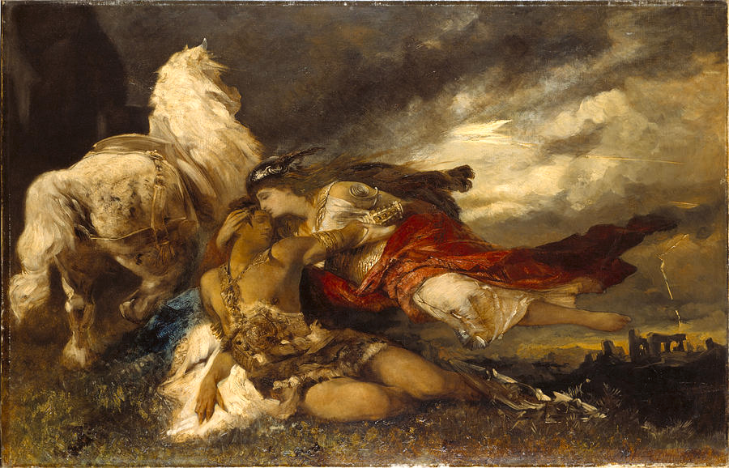
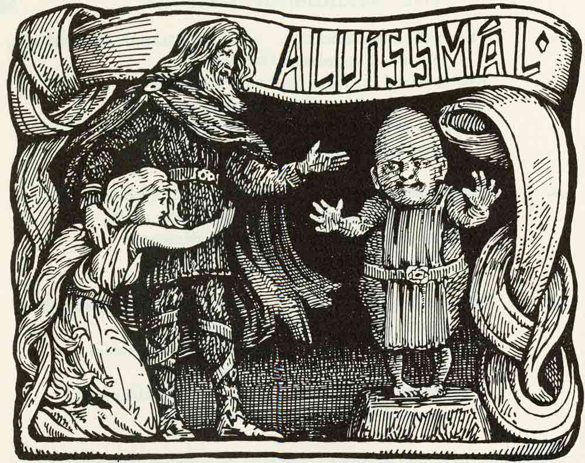
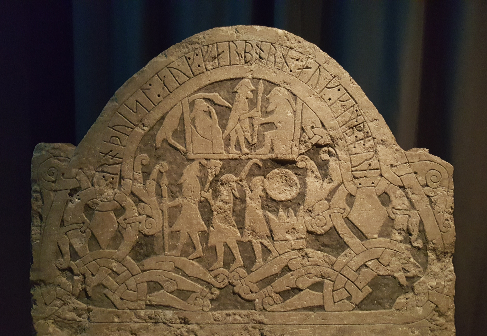
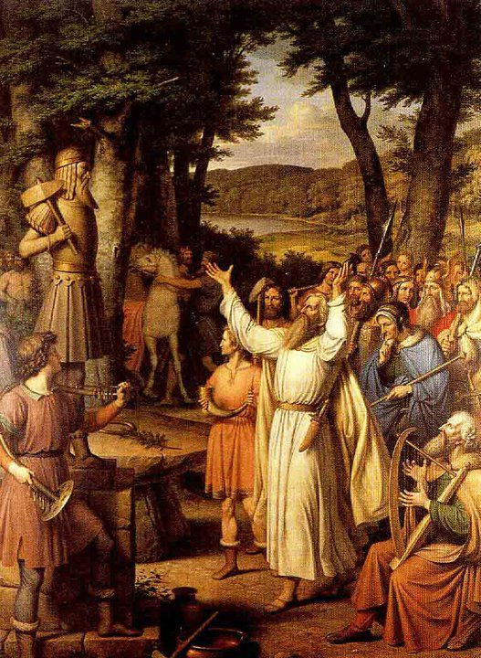
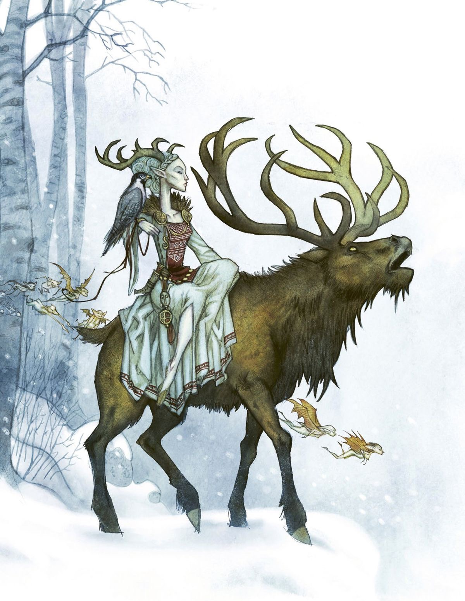
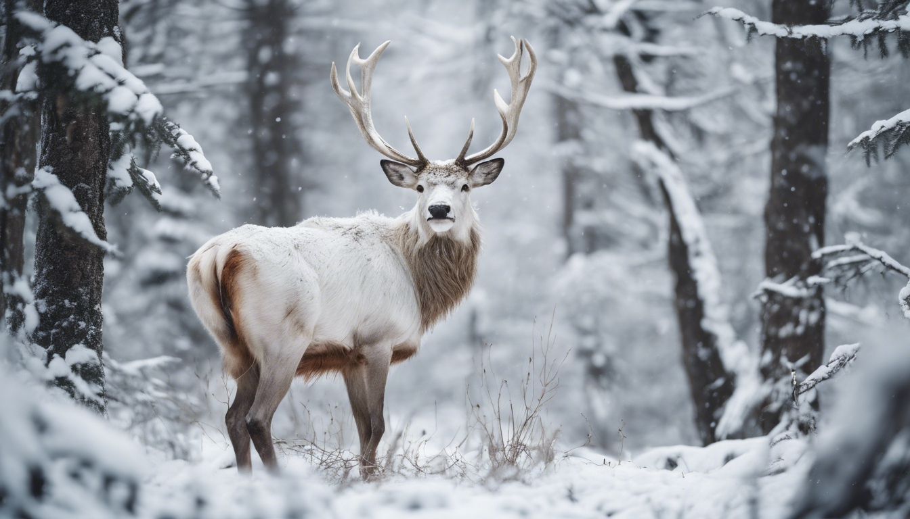
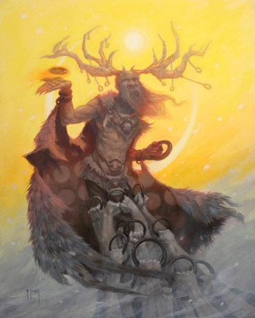

I would begin this by saying that is will be far more ramble-y than a typical essay would be.
I do not have an exact plan for how I want this to go, since it serves as more of a culmination
of my thoughts regarding religion, doctrine, and practice.

### Introduction
I grew up as an atheist, which is a result of being raised in a religiously indifferent household.
I know for sure that my father is not only atheist, but largly anti-religion in general. That being
said, he never directly told me that I should believe this or that and is largely accepting of 
whatever path I choose to follow. My mother is what I would call agnostic, though I am not sure
she has ever said that word before. Her understanding of religion is the one that any person growing
up in the southern United States has. You hear mention of god in sayings and people say grace at
a gathering, despite never doing so on their own.

This circumstance would naturally lead any intelligent person toward aetheism. There was no verifiable
proof of miracles or the divine and people who practice in the southern U.S. are often unable to provide
any meaningful explaination or reasoning behind why they worship god, only that they do and that one
must "have faith". A strange thing to hear if you have never read a bible before.

As I was growing up, I began to become fascinated with ancient mythologies. The stories of the ancient
Greek world were magical and fascinating. The hellenic world view was alien, yet romantic and it captured
my mind just like it does so many others. Later in life, I would gain a renewed fascination with the
Greeks, but that would come not from the gods of their world, but instead from the people and their
philosophies. At this time, though, I loved to read about the world of Greek mythology and read as much
as I could on the subject.

The thing you will come to find about Greek mythology, when you study it beyond highschool reading, is
that the world of Greek mythology is surprisingly coherent. There is a sort of well-structured and 
understandable nature to how everything happens and, unfourtunately, it becomes somewhat predictable.
The stories of mortals are interesting, but usually devolve into a few categories, one of which being
the famous "punished by the gods for their hubris" archetype. My hunger to recapture the original
feeling I got from reading these stories for the first time led me to explore other cultures 
mythologies.

### Norse Pagan Theology
The stories of the Old Norse are unlike anything you will ever read. Popular culture likes to try and
equate the Norse and Greek mythologies, like they are the samething, just replace the togas with chainmail
and swap the names around. Many forms of media have tried to combine all of Norse mythology into a pretty
universe where everything makes sense and fits together, but they end up fabricating material to fill the
gaps in the story and have to stretch or modify the truth to make everything line up. Many aspects of the
cosmos are discarded wholesale for the sake of consistency.

This may seem like a weakness for this kind of literature and, to some, it very well may be. If you like
a story that has a continuous flow from beginning to end with a clean arc for the characters, Norse
mythology simply will not satisfy you. There are often loose ends, inconsistent timings, nonesensical
plot lines, and *one of the most compelling puzzles you will ever experience*.

Instead of viewing Norse mythology as a set of characters in a single coherent timeline, the best way to view 
it is through the lens of archetypes in extreme situations. There is an almost dreamlike feeling that comes from 
Norse myths, like everything that happens is incorporeal and fleeting. These characters may be enemies in this 
story, but in the next they may be allies. There is an underlying feeling of futility in many of the stories,
where there is a hanging prophecy that all of the characters know about, but do not feel the need to try and stop.
A classic Greek trope is the man who attempts to subvert a prophecy, only to end up causing it himself. This
concept is completely non-existant in the Norse conception. Once you know your fate, that is it. It will happen.
There is no attempting to stop it and there is seemingly no desire to stop it from the characters. It gives you
a pretty confusing read at first, when the protagonist goes to a seer at the beginning of the story and they
just tell you exactly how it end, along with most of the steps along the way. Someone who was familiar with Greek
tropes may think they know where the story is going, saying "Ah, a classic tragic hero trope", only for the
story to just literally happen as they said, with no deviation or melancholy about it from the hero.

Needless to say I was one of these people. I had begun my search for something that would stimulate me agian,
after finding that the stories of the Greeks had become predictable, only to be sent on a complete one-eighty
by the Old Norse. The stories were not just alien, but almost unpredictible and dreamlike, despite often being
literally predicted in the story ahead of time. As I read the stories, I tried desparately to form a coherent
world and timeline, but the texts I read did not seem to have a through line beyond specific characters. What
further increased the difficulty was the rarity of Norse mythological sources. There are two major sources,
the Prose and Poetic Eddas, but realistically those sources were collections of disjointed stories that did
not lead to anything concrete. It feels like you are reading an archeologist, digging through these ancient
texts, trying to reconstruct what happened, but everytime you find an answer it lead to even more questions.
The way I would describe a first reading of Norse mythology is as follows
> If only I had one more story, I could finally put all these pieces together

The unfortunate reality of the situation is that finding more sources actually makes the world feel even
more confusing. You may eventually get to the point where you have read enough stories and decide to start
looking at historical finds and actualy ruins and runestones to see what you can uncover, only to discover
that the world you have just spent months obsessing over is just barely scratching the surface of this world.

What you may finally discover, as I did, is that the Norse gods are not people. They are not continuous beings
that exist like we do. They are not physical entities that learn and grow. Instead, they are a sort of static,
archetypal figure that represents a force or idea. I would say that the gods of the Norse act often like how
a charcter in a childrens fairy tale might act. Or a creature in Aesops fables. The stories of the gods are
exactly that, stories. The Norse did not believe in these texts as though they were scripture, like Christians
would with the bible. Instead, they are ways of understanding how a god thinks and behaves. Once I understood this,
it made my fascination with the Norse make much more sense. The world felt like it had some kind of connection
because the characters would behave consistenly accross the stories. They had the same likes and dislike, mannerisms
and movements, thoughts and feelings. So really, what you were trying to construct across the stories was not
a coherent world view, but rather a coherent character view.

This may not be convincing to some, so I will give a few examples. The first one is Freyja, the sister of Freyr
and fairest of the gods. When someone comes from the Greek world view, they may be compelled to ask "what is Freyja
the goddess of?", to which they would recieve a host of answers that conflict with each other massively. Some would say
she is the goddess of love, others lust. Still more might say magic, fertility, or perhaps most confusingly, war. I remember
once talking to a man about Norse mythology, as he had told me that his daughters name was "Freyja". When I asked why
he had named her that, he said something to effect of "Well because Freyja is the goddess of love. And war. And kind of
everything really". The problem with this is that the Norse do not have this conception about "god of". Instead, the archetype
model fits much closer. If you want to understand what all of the elements of Freyja listed have in common, the answer is that
she represents the ultimate object of male desire. If you bear with me, I will explain. Men in the Norse conception are seen
as lusting for two things, beautiful women and battle. The Shieldmaidens of Freyja are the Valkyries, who are described as
unfathomably beautiful women who carry those who die in battle to the afterlife. They are a physical manifestation of the
male desire for conflict and struggle. The lust for battle being literally represented as a beautiful woman. Freyja takes the
idea further, with every aspect of her representing the desires of man. When a man is brought into this world, they do
so at the behest of Freyja, she is a mother's love. When they fall in love themselves, it is at the behest of her, she
is an irresistable attraction. And when they die, it is her sweet kiss at the end that carries them to the afterlife. From
an archetypal perspective, Freyja is wholly consistent. She is oft the object of a story, where a Jotunn demands her as
a bride and the gods needing to come up with an elaborate solution to protect her from those who would take her. This may
feel strange when you start to examine the gods this way, but I find it makes for a more compelling journey.

Then we have Thorr, the god of thunder! Except not really. What does that even mean exactly? Thunder is just the sound of
lighting, it would be like saying he was the god of neighing, when god of horses would make more sense. The reason the name
sticks, however, is because that is literally what thorr means. The etymology of the word Thorr is roughly Thor->Thur->Thunar->Thunder.
That is a gross oversimplification and I am sure the linguists would lynch me, but I think it gets the point across. So you
may ask, "what is the archetype of Thorr, then?". The answer to this is a bit less contorversial than Freyja. He is the meant
to represent men as a whole. Thorr is the symbolic son, with Odinn being the father of the gods. Thorr is also a father, having
many sons, but most notably Magni and Modi. Thorr's role in the stories are almost always what would be expected of a man
in Norse society. Thorr is sent to fight enemies abroad and he defends his home with stoism and bravery. Thorr is a loving
husband and caring father. Some things to note about this that are very interesting characterizations of Thorr that you would
completely miss if you just took "god of thunder" at face value. Thorr does not cheat on his wife, ever. This is common for a
god like Odinn, so Thorr not doing so is significant. Thorr also threatens to kill Loki after Loki shaves his wife's head, he is
defending her honor and takes the attack on her as a personal blow. Thorr is deeply caring about his children. In one story,
Thorr's daughter is unwittingly betrothed to a dwarf. Thorr disapproves of the match, so thorr meets with the dwarf and tells him that he
will only allow this if the dwarf can prove he is wise. He then asks the dwarf a series of progressively more difficult questions,
all of which the dwarf answers correctly. The dwarf failed to realize, however, that he had been talking for so long that the
sun had come up, thus turning him to stone. At the end, Thorr reveals that this was his intention the entire time and the test
proved the dwarf was not as wise as he claimed. So to summarize, Thorr is a good son, father, and husband. Everything that a
man ought to be. Another, albeit less important, thing about Thorr is that he does not have a horse. It is specifically shown
that when other gods are riding somewhere, Thorr simply walks, showing that he is more of a "common man" than an "ubermensch".

It is safe to say that I become completely obsessed with Norse mythology, to the point of reading virtually every source I
could find on the matter, then moving into essays on the history and culture that produced the stories. There was, in a way,
a sense of mystery that came from studying this subject that could not be satisfied with the literature alone. This led me to
research more into the actual religion of the time, to see if some kind of knowledge could be extracted from the historical
document of the Norse culture and practice. This, again, is a road block, as there is very little first hand sources from Scandinavia
at the time. Ths means that if you want to learn about the culture, you have to study this from outside the Norse directly.
Sources from the ancient Roman empire document experiences with the Germanic people, as do middle eastern and, most commonly,
old English sources. These sources are heavily biased, even moreso than the actual myths that survived, so reading them is a
game in and of itself, where you have to not only read, but also scrutinize everything that is said. These source provide a
much different view about the Norse faith than you might expect from a Hellenic viewpoint.

The Norse seemed to have gods come and go in their practice, there was not really a set pantheon that everyone held to. Instead,
you would find that a village here worshipped this god, on there worshipped another. As time went on, some gods became more
popular and well known, which is where the common myths come from. The Norse then believed that the god they worshipped was a
representation of an abstract concept, but that this concept could in some way be swayed by actions of the people on Earth. To
understand how the Norse viewed there interactions with the gods, I think it is important to discuss some other parts of their
culture.

The first principle held to by the Norse is Luck, which has a far different meaning in the modern day. Luck, to the Norse, was a
representation of how likely someone was to succeed and that someones luck was determined by their circumstance. So a person
born into a noble house was "lucky", since they had far more available to them. This, however, is where their idea starts to
differ. Since luck is a pure circumstanstial concept, it was said that you could hurt a persons luck by sabatoging them. So
stealing someones shoes would make them "unlucky". The reason I explain this concept is to show that the Norse had a far more
practical outlook on concepts than you might otherwise think.

Next, the Norse are an animist people, who believe that everything is in some way capable of being interacted with from a spiritual
perspective. A stream, a house, or a forest could all have a spirit tied to them. These would be called vettir, or landvettir for
spirits tied to specific locations. This concpet extends further, though, as an individaul was also said to have a spirit tied to them.. 
This spirit is called a fylgja, which often was represented as an animal and serve as a sort of gaurdian. I suppose the reason I mention
all of this is to say that the Norse understanding of the spiritual and supernatural was not limited strictly to gods and in fact, the daily practice was much more centered on the spirits than on the gods themselves. 

So lets finally discuss the actual beliefs of the Norse, or lack thereof. The Norse did not structurally hold to a rigid belief system
in the same way that Christians do. Christianity is inherently dogmatic, where what you believe is often more important than what you
do. This is fundamentally different from the Norse, who were far more praxiomatic. The Norse held that a persons practice was far more
important than what they actually believed. To the Norse, the gods were real, whether you believed in them or not, so this idea of 
"believing wrong" did not exist. Instead, your understanding and relationship with the gods was grounded in your experiences as they
were shaped by them. Similarly, the afterlife was not something that was held or given, but instead it simple *was* and whether or not
you believed the right thing had no bearing on this. With that in mind, there is no particular sense of urgency with faith for the Norse,
nor is there even much of "daily prayer" in the way Christians have it. It was not expected that the gods would help you if you promised
to follow them, so you were expected to represent you diety in action. That way they might favor you when you came into troubling times.
That being said, your attempts to represent your god would directly result in you "gaining their favor". Allow me to explain.

Let us take Thorr, and call him the archetype of the "good man". If you wanted Thorr's favor, you would do your best to represent what he
values, so you would be a good son, husband, and father. You would practice your martial skills in order to become a better defender as
he is. You would make sure that you are well fed and strong. These attempts to appease your god would make you come to resemble them. Then,
when bandits come to your door and you pray for the protection of thor, you have already achieved this, since it is you effort to gain his
favor that gave you what you desired to being with. In this sense, a cult to a particular god was a group who emphasized the ideals of that
archetype to the point that they all resembled them. I would say, however, that it is more nuanced than just "the gods are abstract ideals".
If you followed that mindset, you would hit a road block when you got to the concept of blot.

The blot was the holotype Norse ritual. It involved a bonfire, drinking mead from horns, shouting to the gods, and making sacrifices in
their name. This was done before and after growing seasons, or it would happen before great battles and expiditions. This was seen as 
a more significant event than the day to day. These events were an attempt to gain the attention of the gods. It was not really this
idea that "oh, if I kill my best horse, then Freyr will make the crops grow". Instead it was a type of reciprocity. This was the idea that
"gifts are given for gifts recieved". The hope being that if you thanked the gods for what they have already given you, that you took
the time to be appreciative for what you have and all you have to lose, that the gods might be more willing to favor you in the future.
The interesting part about this practice is that it tends to create an effect not dissimilar to a "sunk cost fallicy". To explain this,
I would argue that person who has sacrificed a lot to achieve something is more likely to try harder. If you have invest a lot of money
into something, you are much more likely to want to continue it or see it to its conclusion. In this same way, I would say that the
blot serves as a way for a group of people to motivate themselves as a collective to accomplish something and that by all of them giving up
something important in its name, they are more willing to see it through.

So what is the point in discussing Norse practice? Well, after spending so long studying this field, I began to start thinking in the same
way that the Norse did. When a person spends all their time reading about a subject, they start to identify with it very deeply. This
idea that you could, in a sense, "fake it till you make" ideology was very appealing to me. I didn't have to actually *believe* in these
beings, just following the practice could in theory improve my life. It could be viewed as "manifesting", if it wasn't a social media trend
for chronically online women, and taken to a near logical extreme. So, I did.

This mock ritual of sorts that I started doing was incredibly useful psychologically. Taking time to reflect on where I was at in life and
where I wanted to be was infinitely helpful in establishing what I needed to do for the future. Sacrificing my time and to ask Odinn for
success in my studies and for wisdom in my day to day led me to pay more attention in lecture and to think twice before acting. To Thorr, it
helped me to be motivated in the Gym and to monitor my diet. These were real benefits that I got by pretending to worship a god. And after a
certain point, I wasn't pretending anymore.

After a certian point, I moved beyond simply meditating, which is a sacrifice of time, to material sacrifice. I would give up food, or drink
in the name of the gods, but such a procedure in the home required clean up, so I ended up creating a place for ritual in the yard. A first,
it was just a table in the tree line, then it was a cirle of stones, then it was a circle of posts, then the posts were carved from top to
bottom in runes and the stone were delicately placed and the table stood at the center. The sacrifices kept the ground fertile and maintaining
the circle became part of my ritual. If I were asked how Norse day to day practice felt, I would say that this was a perfect example. I was
doing all of this without a true "belief" in the gods. Instead, I was revering what they stood for and due to that, was simply revering them.

It was around this time that I started to feel there was more to this than just "placebo on steriods". There was a sort of presence that was
felt when doing the ritual and it was stronger when the ritual was done well and when I was in the right headspace. This is where meditation
took a turn from simple contemplating myself to specifically speaking to the gods. I did not ever hear a voice in answer, but I can say that
I came to feel as though someone was actually listening. I could feel shocks down my spine when I invoked them and I would feel eyes burning
into my head when I gave them praise. It felt truely like I had communicated with something orders of magnitude larger than myself. It did
not feel friendly, but rather vast and overwhelming in its presence.

These feelings were not present at every ritual, but when they did happen, it felt like the entire world was at your back, like you could
accomplish anything. I started to notice that in certain circumstances, you could invoke more clearly than others. Calling the name of Thorr
whilst in a thunderstorm had a profound effect and soon I came to feel that whenever thunder boomed, Thorr was not far. When the cold winter
frost bit my ears and nose, Ullr was there and a prayer to him felt real. I would say by this point, I was converted to this religion. I was
an honest practicioner of Norse Heathenry, a pagan inside and out. Would I still call myself one to this day? My honest answer would likely
have been no, had it not been for one thing.

At somepoint during this time, in the winter, I had a dream.

The dream was unlike anything I can raelly describe. What I remember most distinctly, however, was that I was fully conscious of the experience.
I layed down to sleep and closed my eyes. Only for a second, it was more of a blinking than trying to sleep, but when I opened them I was standing
at the edge of a forest. It was a boreal forest in the dead of winter, with snow on every surface. I was dressed in the as I had been when I
went to sleep, which was not particularly well insulated, but I did not feel cold. I stood for a moment to try and figure out where I was, but as 
things are with dreams, nothing is concrete. This is when a figure walked out from the tree line. He ducked and stepped out of the trees, but sort
of materialized as he walked. The figure must have been near ten foot tall, towering over me, but not threatening. He had a pale, almost blueish
skin and white hair all around. He was sickly thin and skinny, but somehow still toned in musculature. Strong, despite his figure. His hair was 
somewhat spikey, almost frozen looking. He had soft eyes, though, and his pesence felt like the comfort a child would get around their father. And
to that end, he seemed to regard me as a child, I felt that he was older than I could possibly comprehend and that he almost seemed to regard me
as a something he has seen thousands of times. He turned and began walking into the forest, in which a path through the treeline had miraculously
appeared. I walked beside him, for a while, through the snow, until we came to a clearing in the trees. There was nothing of note here, save for a
few stones scattered about. The path through the woods was gone now and I was in this clearing with the figure, who picked up a stick from the 
ground and handed it too me. When I took it, and examined it more closely, the branch had become a bow, already strung. Was it like that from the
start? I did not believe so. We turned and looked down the clearing, where once there was a rock, now stood a target. The figure guided my hands
and showed me to use the tool. I missed the first shot, but he was not disappointed, instead his face seemed like that of a teacher who had seen
this countless times. He guided me again, I missed a again, then on the last try I struck the target. I felt elated, incredible, really. I looked
up at the figure to see that he was not as excited as I, but did seem to have some sort of satisfaction because of me. The bow was gone when I
looked back and the figure was dragging a long hammer behind him, much too large and heavy for someone of his figure, but still he dragged it to a
stone, which he then struck with the hammer and it instantly became dust. I saw him scoop up the dust and come toward me. He knelt down and I
heard his voice for the first time. It was unlike anything on Earth. Haunting and beautiful, completely indescribable. He did not speak, but instead
began to sing in a low voice, in a language I could not understand. As he sung this song, he took some of the dust with his free hand and 
drug it across my forhead, leaving the sparking dust there. I closed my eyes, and when I opened them, I was back in my bed and it was many hours
later in the night. I have never taken the time to describe this experience before and it is hard to truly recount the events as I saw them, but
I would say this is my first and only direct interaction with a Deity, one that felt like a continuous stream of consciousness from start to
finish, no sense of time loss from one moment to the next and not feeling of sleeping or dreaming. It was incredible.

I spent some time researching what I had witnessed, as I did not know what to make of it. I recalled in my mind a rarely mentioned god of the Norse
called Ullr. Ullr was mentioned as a god of winter, but his stories were not nearly as prominent as many of the other gods. I looked into this god
deeper and found that he was indeed also considered a god of archers and skiers. That coincidence seemed too much to ignore. I looked for images
of the god and came across the one below

This image is very interesting to me. Not because it is exactly what I saw in my dream, but it shares a similar feeling as was evoked by it. A tall
and slender figure with pale skin and white hair, who looks like they wandered straight out of a forest in the winter. What strikes me the most about
Ullr is that he is mentioned very rarely, yet appears to have been one of the central gods of the old Norse. All across Scandinavia there are towns
and cities named after him. The ancient Roman historians mention him specifically as one of the primary gods of the Germanic people and even goes so
far as to claim that when Odinn was not present, Ullr ruled Asgard. Then in the Poetic Edda, Odinn, in disguise, offers to give the blessings of Ullr
and all the gods to an individual if they help him and this is reinforced by a scene from Atlakviða, where a feast takes place and oaths are sworn on rings,
reserving the most solemn oath of all for Ullr. Ullr is said to be the son of Sif and the stepson of Thorr, with is primary association being with
skiing, skating, hunting, honourable duels, and oaths. Indeed Ullr is said to like in a yew forest, with yew wood being excellent for crafting bows.

From this point, I started dedicating the majority of my rituals to Ullr. Ullr was indeed my patron deity at this point, with Thorr, Odinn, and Tyr occupying
most other interactions. One thing I came to realize is that Ullr was very strongly tied to the winter and when the season ended, it was near impossible for
me to feel as though I was connecting with him. This would make sense, of course, as an archetypal winter figure would be poor to emulate in the summer. I
already enjoyed the winter season and this forced me more into this niche. I found that my life was objectively better and happier in the cold and even
my ability to be religious became tied to the season. In the winter I also came to worship Skadi, the divine feminine aspect of winter. I had not engaged
with the divine female much up to this point, but I felt it was right now. The down side of becoming this invested is that I developed a sort of seasonal
depression. It is ironic, however, that this depression was in the summer and not in the winter, as you would typically expect. One thing I would clarify
is that this depressive tendency did not occur because of my worship of Ullr, but rather I would say it is a product of my own personality, expressed 
through my faith. This would essentially be the foundation of my religious knowledge going into the future.

This however, has gotten very long, so I will continue with this journey in the future.